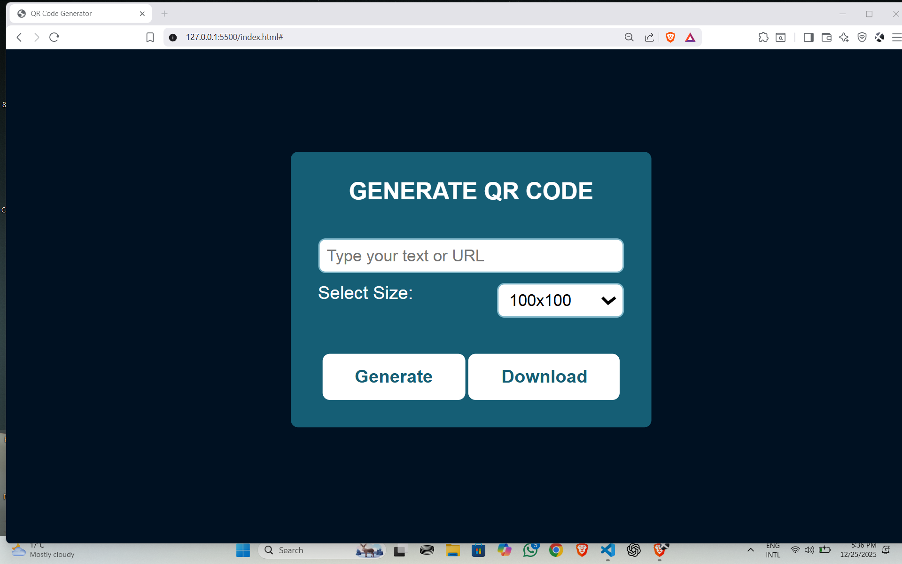

# QR Code Generator 📱

A simple and clean web application that generates QR codes for any text or URL. Built using standard web technologies.



## 🚀 Features
* **Instant Generation:** Convert text or URLs into QR codes immediately.
* **Clean UI:** A user-friendly interface designed with CSS.
* **Lightweight:** Built using vanilla JavaScript without heavy framework dependencies.

## 🛠️ Tech Stack
* HTML5
* CSS3
* JavaScript

## 💻 How to Run locally
1.  Clone the repository:
    ```bash
    git clone [https://github.com/pratikkdahal/QR-Code-Generator.git](https://github.com/pratikkdahal/QR-Code-Generator.git)
    ```
2.  Navigate to the project folder.
3.  Open `index.html` in any web browser.

## 🌐 Live Demo
[View Live Project](https://pratikkdahal.github.io/QR-Code-Generator/)
